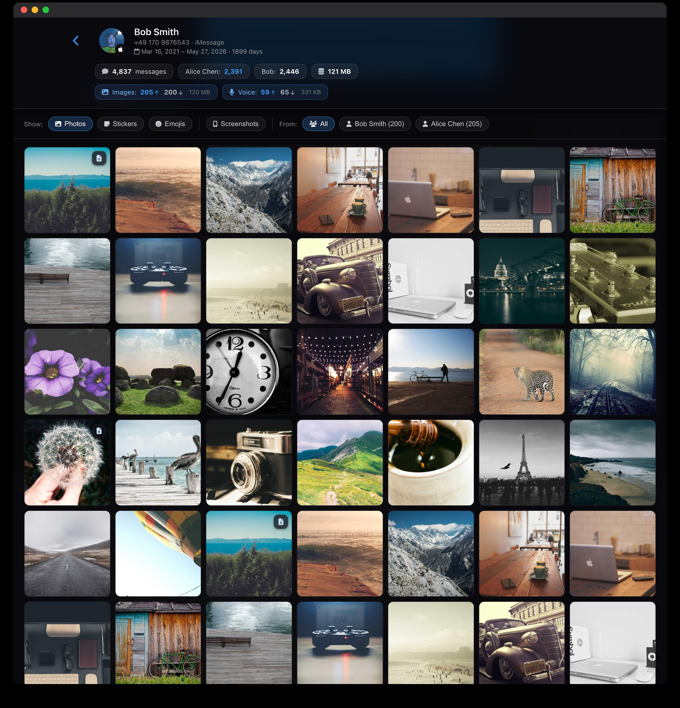

# Message Visualizer

> Local, source-agnostic chat archive viewer for iMessage, WhatsApp & more.
> Heatmap, search, audio transcription and OCR — fully offline, your data
> never leaves the machine.

[](LICENSE)


*The CLI / package name is `msgviz` — that's what you type in the shell.
"Message Visualizer" is the project name.*

---

## Install

Requires **Python ≥ 3.10** on **macOS** or **Linux** (~200 MB disk for
the venv + dependencies + bundled demo). Everything else — `ffmpeg`,
`whisper-cli`, OCR — is *optional* and only needed for the
corresponding feature. After install, [`msgviz check`](#verify-your-install)
tells you exactly what works on your machine.

### Option A — Try the demo (30 seconds, no real data needed)

```bash
git clone https://github.com/homegrownhuman/msgviz.git
cd msgviz
bash scripts/quickstart.sh --open
```

The script creates a venv, installs `msgviz`, points `MSGVIZ_HOME` at
the bundled `demo/` directory, and starts the server at
<http://127.0.0.1:8753/>. The demo dataset has 6 chats across two
devices, ~21,700 messages spanning 2.3–5.2 years, real photos, voice
notes, and a calendar heatmap. Your live `data/` directory stays empty.

### Option B — Install for your own archive

```bash
git clone https://github.com/homegrownhuman/msgviz.git
cd msgviz

bash scripts/setup.sh             # venv + pip install -e . + system-dep check + msgviz init
source .venv/bin/activate

# Declare your first person, device, and chat
msgviz person add "Alice" --handles "alice@example.com,+491701234567"
msgviz device add wa_archive --name "iPhone 14 (WhatsApp backup)" \
                             --type static --owner "Alice"
msgviz chat add wa_archive --slug bob --title "Bob" --origin whatsapp

# Import the data — point at a WhatsApp chat export folder
msgviz import whatsapp \
    --device wa_archive \
    --folder ~/Downloads/WhatsApp\ Chat\ -\ Bob \
    --slug bob \
    --me "Alice"

msgviz status
msgviz serve                      # → http://127.0.0.1:8753/
```

`setup.sh` also checks for the optional system tools (`ffmpeg`,
`whisper-cli`, OCR) and prints install hints for whatever's missing.

The import command emits a live progress tree: each phase shows a
spinner while running, then a ✓ with item counts, duration, and the
most recent status note. A finished 1,200-message import looks like
this:


For iMessage backup imports, live iMessage sync (macOS), avatars,
group chats, and reverse-proxy setup, see
[**docs/GETTING_STARTED.md**](docs/GETTING_STARTED.md) and
[**docs/CLI.md**](docs/CLI.md).

---

## What it looks like


Click into any chat for the timeline, the heatmap, the media overview,
or the voice-notes browser (click a thumbnail for the full view):

<table width="100%">
  <tr>
    <td width="33%" align="center" valign="top">
      <a href="docs/screenshots/page-chat.png" title="Chat + heatmap"></a>
    </td>
    <td width="33%" align="center" valign="top">
      <a href="docs/screenshots/page-media.jpg" title="Media overview"></a>
    </td>
    <td width="33%" align="center" valign="top">
      <a href="docs/screenshots/page-voice.png" title="Voice notes"></a>
    </td>
  </tr>
</table>

Your real archive under `data/` is not touched — see
[*The Three-Environment Model*](docs/GETTING_STARTED.md#2-the-three-environment-model).

For a step-by-step walkthrough including your own archive, avatars,
imports and reverse-proxy setup, see
[**docs/GETTING_STARTED.md**](docs/GETTING_STARTED.md).

---

## Verify your install

```bash
msgviz check        # selftest — see exactly what works on your machine
```

`msgviz check` probes every dependency (Python, FastAPI/uvicorn,
Pillow, ffmpeg, whisper-cli, the Whisper model, OCR engines, live
iMessage access) and reports — per feature — whether it's *ready*,
*degraded* (works without that piece), or *not available*. For
anything missing it prints the consequence and the exact fix.


> Exit code 0 means the server can run. Exit code 1 means baseline
> is broken (Python < 3.10 or core packages missing). Pass `--json`
> for machine-readable output, `--verbose` for the per-probe table.

---

## Dependencies

Message Visualizer is **modular** — it works with whatever subset of
optional tooling you have. `msgviz check` tells you which features
each missing piece would unlock. Full inventory (Python packages,
system bins, frontend libraries, models) in
[**docs/STACK.md**](docs/STACK.md).

<table width="100%">
  <tr>
    <th align="left">Component</th>
    <th align="left">Required for</th>
    <th align="left">Install (macOS)</th>
    <th align="left">Install (Linux)</th>
  </tr>
  <tr>
    <td>Python ≥ 3.10</td>
    <td>Everything</td>
    <td><code>brew install python@3.12</code></td>
    <td><code>apt install python3.12 python3.12-venv</code></td>
  </tr>
  <tr>
    <td>fastapi, uvicorn, typer, rich</td>
    <td>Server + CLI</td>
    <td><code>pip install -e .</code> (auto)</td>
    <td><code>pip install -e .</code> (auto)</td>
  </tr>
  <tr>
    <td>Pillow</td>
    <td>Image thumbnails, demo asset gen</td>
    <td><code>pip install -e '.[dev]'</code></td>
    <td><code>pip install -e '.[dev]'</code></td>
  </tr>
  <tr>
    <td>ffmpeg</td>
    <td>Voice note conversion</td>
    <td><code>brew install ffmpeg</code></td>
    <td><code>apt install ffmpeg</code></td>
  </tr>
  <tr>
    <td><a href="https://github.com/ggerganov/whisper.cpp">whisper.cpp</a> <code>whisper-cli</code></td>
    <td>Audio transcription</td>
    <td><code>brew install whisper-cpp</code></td>
    <td>build from source</td>
  </tr>
  <tr>
    <td>Whisper model (<code>ggml-large-v3.bin</code>)</td>
    <td>Audio transcription</td>
    <td>curl from huggingface (~3 GB)</td>
    <td>same</td>
  </tr>
  <tr>
    <td>macOS Vision binary</td>
    <td>Screenshot OCR (best quality)</td>
    <td><code>swiftc -O tools/ocr/ocr.swift -o tools/ocr/ocr</code></td>
    <td>n/a</td>
  </tr>
  <tr>
    <td>Tesseract</td>
    <td>Screenshot OCR (cross-platform)</td>
    <td><code>brew install tesseract</code> + <code>pip install 'msgviz[ocr-tesseract]'</code></td>
    <td><code>apt install tesseract-ocr tesseract-ocr-eng tesseract-ocr-deu</code> + <code>pip install 'msgviz[ocr-tesseract]'</code></td>
  </tr>
  <tr>
    <td>Full-Disk-Access for the terminal</td>
    <td>Live iMessage sync (macOS only)</td>
    <td>System Settings → Privacy & Security</td>
    <td>n/a</td>
  </tr>
</table>

Anything not installed *degrades* the corresponding feature; the rest
of msgviz still runs. The server, both importers (WhatsApp, iMessage
backup), search, the heatmap and the avatar system work with **only**
the four core packages.

---

## Why this tool

Archiving messages across several sources (live iMessage, iMessage backups,
WhatsApp exports) usually means juggling a patchwork of single-purpose tools.
**Message Visualizer unifies them** in one database, one web UI, one
person-centric view:

* **All chats with one person across services** — Bob on iMessage and WhatsApp
  is the same person, not two.
* **100% offline** — no cloud upload, no trackers, no external API.
* **Local audio transcription** with [whisper.cpp](https://github.com/ggerganov/whisper.cpp)
  (Metal-accelerated on Apple Silicon).
* **OCR for screenshots** — macOS Vision (best quality) or Tesseract as a
  cross-platform fallback.
* **Web UI with calendar heatmap, search, media overview, live push** for
  incoming iMessages.
* **Avatars** — content-hashed, surfaced on devices, 1:1 chats and per
  message; manually assignable from any image file.
* **Adapter pattern** — new sources (Signal, Telegram, SMS backups) are a
  module, not a fork.

## Status

🟡 **Alpha.** Runs in production on macOS (Apple Silicon) with tens of
thousands of messages and thousands of media items. Linux support is
implemented (Tesseract OCR, no live iMessage sync) but less tested.
Schema and API are not yet guaranteed to be stable.

## Three Environments

`MSGVIZ_HOME` decides which directory holds the DB, media, and config.
Three wrappers preset it for you:

<table width="100%">
  <colgroup>
    <col width="30%">
    <col width="20%">
    <col width="50%">
  </colgroup>
  <tr>
    <th align="left">Wrapper</th>
    <th align="left"><code>MSGVIZ_HOME</code></th>
    <th align="left">Purpose</th>
  </tr>
  <tr>
    <td><code>msgviz …</code></td>
    <td><code>data/</code></td>
    <td>Your live archive</td>
  </tr>
  <tr>
    <td><code>./scripts/msgviz-dev …</code></td>
    <td><code>dev/</code></td>
    <td>Throwaway sandbox</td>
  </tr>
  <tr>
    <td><code>./scripts/msgviz-demo …</code></td>
    <td><code>demo/</code></td>
    <td>Bundled showcase dataset</td>
  </tr>
</table>

The demo lives entirely in `demo/`. Experiments live entirely in `dev/`.
Nothing leaks into your live `data/` without your explicit say-so.

## Supported sources today

<table width="100%">
  <tr>
    <th align="left">Source</th>
    <th align="left">Status</th>
  </tr>
  <tr>
    <td><b>iMessage live</b> (macOS, <code>~/Library/Messages/chat.db</code>)</td>
    <td>✅ incremental sync + live push</td>
  </tr>
  <tr>
    <td><b>iMessage backup</b> (iOS backup in MobileSync folder)</td>
    <td>✅</td>
  </tr>
  <tr>
    <td><b>WhatsApp export</b> (<code>_chat.txt</code> + attachments, iOS and Android format)</td>
    <td>✅ German / English / Italian / Spanish / Dutch</td>
  </tr>
  <tr>
    <td>Signal</td>
    <td>⏳ adapter open for contributions</td>
  </tr>
  <tr>
    <td>Telegram</td>
    <td>⏳ ditto</td>
  </tr>
</table>

## Architecture in 5 sentences

* **`msgviz/core/`** — data models, DB schema, person resolver, sync.
* **`msgviz/adapters/`** — one module per source, yielding
  `CanonicalMessage`s (`iter_messages()` as Protocol).
* **`msgviz/workers/`** — transcription, OCR, media processing — incremental,
  race-safe, with progress reporter.
* **`msgviz/server/`** — `create_app(MVConfig)` returns a FastAPI app that
  runs standalone or as a sub-mount in any host server.
* **`app/`** — vanilla JS frontend (heatmap, chat, media) — no build step,
  usable on its own if you want.

Deep architecture: [docs/ARCHITECTURE.md](docs/ARCHITECTURE.md).

## Docs

<table width="100%">
  <colgroup>
    <col width="35%">
    <col width="65%">
  </colgroup>
  <tr><td><a href="docs/GETTING_STARTED.md">docs/GETTING_STARTED.md</a></td><td>Linear walkthrough — clone → demo → own archive</td></tr>
  <tr><td><a href="docs/CLI.md">docs/CLI.md</a></td><td>All <code>msgviz</code> subcommands with examples</td></tr>
  <tr><td><a href="docs/API.md">docs/API.md</a></td><td>HTTP API reference (REST + WebSocket)</td></tr>
  <tr><td><a href="docs/SCHEMA.md">docs/SCHEMA.md</a></td><td>SQLite tables, conventions, migration policy</td></tr>
  <tr><td><a href="docs/STACK.md">docs/STACK.md</a></td><td>Full inventory of Python deps, system bins, frontend assets</td></tr>
  <tr><td><a href="docs/EMBEDDING.md">docs/EMBEDDING.md</a></td><td>Mount Message Visualizer inside your own FastAPI app</td></tr>
  <tr><td><a href="docs/FRONTEND_KIT.md">docs/FRONTEND_KIT.md</a></td><td>Drop the frontend into a different host</td></tr>
  <tr><td><a href="docs/ARCHITECTURE.md">docs/ARCHITECTURE.md</a></td><td>Deeper architecture</td></tr>
</table>

## Related tools

<table width="100%">
  <tr>
    <th align="left">Tool</th>
    <th align="left">Focus</th>
    <th align="left">Stars</th>
    <th align="left">What Message Visualizer does differently</th>
  </tr>
  <tr>
    <td><a href="https://github.com/ReagentX/imessage-exporter">ReagentX/imessage-exporter</a></td>
    <td>iMessage → text/HTML</td>
    <td><a href="https://github.com/ReagentX/imessage-exporter/stargazers"></a></td>
    <td>viewer + multi-source + local transcription, not just export</td>
  </tr>
  <tr>
    <td><a href="https://github.com/KnugiHK/WhatsApp-Chat-Exporter">KnugiHK/WhatsApp-Chat-Exporter</a></td>
    <td>WhatsApp backups → HTML</td>
    <td><a href="https://github.com/KnugiHK/WhatsApp-Chat-Exporter/stargazers"></a></td>
    <td>merges WhatsApp and iMessage, dedupes by person</td>
  </tr>
  <tr>
    <td><a href="https://github.com/Pustur/whatsapp-chat-parser-website">Pustur/whatsapp-chat-parser-website</a></td>
    <td>WhatsApp export, browser-only</td>
    <td><a href="https://github.com/Pustur/whatsapp-chat-parser-website/stargazers"></a></td>
    <td>handles images + audio + transcription, multi-source</td>
  </tr>
</table>

## Privacy

* The DB (`data/visualizer.db`), media (`media/`, `originals/`) and
  generated JSON caches (`data/transcripts.json`, `data/ocr.json`,
  `data/chats/`) live only on your machine. They are excluded via
  `.gitignore`.
* No telemetry, no cloud sync, no external API calls at runtime
  (except local `whisper-cli` and `tesseract`/`vision`).
* The HTTP server binds to `127.0.0.1` by default. If you expose it
  publicly, add an auth layer yourself (see
  [docs/API.md](docs/API.md#cors-auth-https)).

## Roadmap

- [ ] Signal adapter (local Signal Desktop DB)
- [ ] Telegram adapter (Telegram export JSON)
- [ ] SMS backup reader (Android XML)
- [ ] UI language switcher (interface localization, currently EN-only)
- [ ] First-install script for Linux
- [ ] CI pipeline with test badge

## Contributing

Issues, PRs and bug reports welcome. See
[CONTRIBUTING.md](.github/CONTRIBUTING.md) for conventions.

Before a larger refactor, skim
[docs/ARCHITECTURE.md](docs/ARCHITECTURE.md) — there are intentional
design choices (adapter pattern, source-agnostic schema, local JSON
caches for transcripts/OCR) that aren't obvious.

## License

[MIT](LICENSE) — use freely, modify, redistribute.
