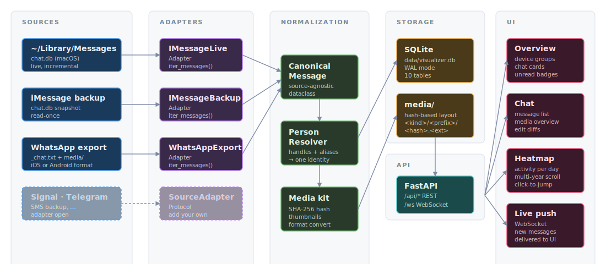
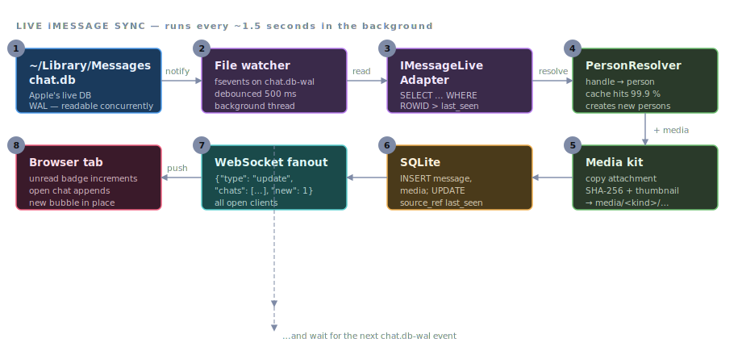
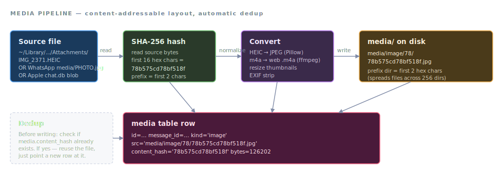

# Architecture

This document describes how msgviz is structured today — what each
piece does and how they fit together. It's meant for contributors who
want to find the right place to add a feature or fix a bug.

For the user-facing API, see [API.md](API.md).
For the CLI surface, see [CLI.md](CLI.md).
For the database tables, see [SCHEMA.md](SCHEMA.md).
For the full inventory of dependencies, see [STACK.md](STACK.md).

---

## End-to-end at a glance



Source data never leaves the machine. Adapters yield a uniform
`CanonicalMessage`; the resolver merges identities across sources; the
DB is the single source of truth that both the API and the live watcher
operate on.

---

## Layout at a glance

```
msgviz/
├── core/         data model, schema, sync, person resolution, OCR engines
├── adapters/    one module per source (iMessage live/backup, WhatsApp export)
├── workers/     transcription, OCR, media processing
├── server/      FastAPI app factory + routes
├── cli/         Typer subcommands
├── mediakit/    image/audio/video conversion
├── config.py    MVConfig dataclass
├── paths.py     central path resolution
├── __main__.py  python -m msgviz entry
└── __init__.py  package marker
app/             vanilla JS frontend (no build step)
tests/           pytest suite (unit + integration)
docs/            this directory
scripts/         setup.sh (platform auto-detect)
```

Three top-level files outside the package:

* `index.html`, `chat.template.html` — the HTML templates the server
  renders (with a `{{base}}` placeholder for sub-mount support).
* `export_data.py` — historical helper used by the WhatsApp importer
  and the iMessage adapter for attribution decoding. Will be folded
  into `msgviz/core/` in a later cleanup.

---

## Data model

The schema lives in `msgviz/core/schema.sql`. It's source-agnostic on
purpose — neither Apple nor WhatsApp leak into column names. Full
table reference: [docs/SCHEMA.md](SCHEMA.md).

```
person ──< handle           (one person, many phone/email handles)
   │                        (case-insensitive aliases via person_alias)
   │ (owner)
device ──< chat ──< message ──< media
                 └─ chat_participant >─ person
                 └─ chat_source            (source instance link)
                                ↑
                                │
                          source_ref      (per-message dedup anchor)
```

Key choices:

* **One person, many handles.** A handle is a phone number or email.
  `person_alias` adds case-insensitive name spellings so that "Bob
  Smith" and "Bob" merge on import.
* **`device.owner_person_id`** is the "me" perspective for that device.
  Drives the `is_me` flag on incoming messages.
* **`source_ref(source, external_id)`** is the only place where a
  source-specific identifier surfaces. The sync loop uses it for
  per-source-instance deduplication so the same iMessage row from
  two devices doesn't merge into one row.
* **`message.edits`, `reactions`, `apps`** are JSON columns — read
  together with the message, no extra joins.

The schema is small (about a dozen tables) and is the contract
adapters and the API both depend on.

---

## Sources and adapters

Every source implements the `SourceAdapter` protocol in
`msgviz/core/source_adapter.py`:

```python
class SourceAdapter(Protocol):
    def open(self) -> None: ...
    def close(self) -> None: ...
    def iter_chats(self) -> Iterable[ChatSpec]: ...
    def iter_messages(self, chat_spec) -> Iterable[CanonicalMessage]: ...
```

`CanonicalMessage` (`core/canonical.py`) is the shared currency: a
plain dataclass with sender, timestamp, text, attachments, reactions,
edits. Adapters convert their native format to it; the importer/sync
writes it into the DB.

Current adapters:

| Adapter | Source | Notes |
|---|---|---|
| `imessage_live` | macOS `~/Library/Messages/chat.db` | Incremental, live watcher |
| `imessage_backup` | iOS backup in MobileSync folder | Static snapshot |
| `imessage_db` | Arbitrary Apple chat.db file | Internal helper used by the other two |
| `whatsapp_live` | macOS WhatsApp Desktop `ChatStorage.sqlite` | Incremental; macOS only; reads the plaintext on-disk DB |
| `whatsapp_export` | `_chat.txt` + attachments folder | German/English/Italian/Spanish/Dutch |

Adding a new source = drop a module in `msgviz/adapters/`, implement
the protocol, register it. Nothing in `core/` needs to know about it.

### WhatsApp live (`whatsapp_live`)

WhatsApp Desktop for macOS keeps chats in a **plaintext SQLite** file
(`ChatStorage.sqlite`, Core Data `ZWA*` tables) under
`~/Library/Group Containers/group.net.whatsapp.WhatsApp.shared/`.
`whatsapp_live` reads it the same way `imessage_live` reads Apple's
`chat.db` — a local file read, no network, no companion-device pairing,
no account-ban risk. (The "why this over a WhatsApp-Web client library"
rationale lives in [docs/proposals/whatsapp_live.md](proposals/whatsapp_live.md);
short version: linked-device clients carry a real ban risk, the
local-file path doesn't.)

`whatsapp_db.py` does the row→`CanonicalMessage` mapping (Core Data
seconds→Unix epoch, group-sender resolution via `ZWAGROUPMEMBER`, media
via `ZWAMEDIAITEM`); `whatsapp_live.py` is the `SourceAdapter` wrapper.
Imported through `msgviz import whatsapp-live` (see
[docs/CLI.md](CLI.md)). macOS only; Windows/Linux is out of scope for
now (Windows stores chats in a WebView2 IndexedDB blob, not SQLite).

---

## Sync and incremental updates



End-to-end latency from "iMessage hits `chat.db`" to "new bubble visible
in your tab" is typically 200–600 ms. The watcher dedupes against
`source_ref.external_id` so the same Apple `ROWID` is never inserted
twice.

`msgviz/core/sync.py` is the entry point for iMessage sync. It:

1. Opens the appropriate adapter for each `mac_live` device.
2. Reads chat-by-chat, deduplicating against `source_ref` (no row is
   written twice).
3. Marks newly inserted rows `sync_state='new'`. The frontend uses
   this for the unread badge.
4. Returns stats (`new`, `updated`, `skipped_devices`).

Cross-platform behavior: on non-Darwin systems, `mac_live` devices are
skipped with a stderr notice. The live watcher in `server/factory.py`
no-ops on non-Darwin entirely.

WhatsApp **live** sync is incremental like iMessage, via
`tools/import_whatsapp_live.py` (`msgviz import whatsapp-live`),
deduping on `source_ref` keyed `whatsapp_live:<device>` + the WhatsApp
`ZSTANZAID`. WhatsApp **exports** are not incremental — one-shot
imports via `tools/import_whatsapp_export.py` (`msgviz import whatsapp`).

---

## Schema drift detection

Apple and Meta own the on-disk formats msgviz reads, and they change
them — Apple with macOS/iOS releases, Meta with WhatsApp Desktop
updates. Left unguarded, a column rename or a new message-type code
turns into silently-wrong data (messages mis-attributed, rows dropped).
`msgviz/core/drift.py` makes that **loud** instead.

Each adapter ships a **schema contract** (`*_schema.py`) describing the
tables/columns it relies on and the enum values it understands. Before
reading, the adapter probes its source against the contract and
classifies any difference:

| Severity | Trigger | Behaviour |
|---|---|---|
| `fatal` | required table/column missing, or a required column's storage class changed | abort the run, write nothing |
| `warn` | new column appeared, optional column gone, unknown enum value, a single unparseable row | continue; skip-and-record the offending row |
| `info` | known-but-rare expected change | recorded only |

Events are persisted in the `drift_event` table (deduped by
`(source, kind, table, column, observed)` so repeats bump a counter,
not spam rows; acknowledging sets `acknowledged_at`, never deletes —
the audit trail survives). The design principle: **no silent
`except: pass` in any ingestion path.** The one sanctioned place an
exception is swallowed is `drift.safe_canonicalize`, which turns a
per-row parse failure into a `row_parse_failed` warn event.

It's cross-cutting: the same machinery covers `imessage_live`,
`imessage_backup`, `whatsapp_live`, and `whatsapp_export` (whose
"schema" is its date-line formats + locale markers, so its drift kinds
are `unknown_export_format` / `unknown_export_locale`). Wide vendor
tables (Apple's `message` has ~60 columns; we read 14) set
`flag_new_columns=False` so a normal DB doesn't raise dozens of
false `new_column` warnings — only *losing* a column we depend on is
flagged.

Drift surfaces on four channels: the import command's run output,
`msgviz check`, the dedicated `msgviz drift` command (list / explain /
acknowledge — see [docs/CLI.md](CLI.md)), and a banner in the web UI
fed by `GET /api/drift`. The full design rationale is
[docs/proposals/whatsapp_live.md §13](proposals/whatsapp_live.md).

---

## Person resolution

`msgviz/core/person_resolver.py` is the single place that decides
"this name/handle belongs to which person?" It:

* Looks up `handle.value` for exact phone/email matches.
* Looks up `person.display_name` and `person_alias.value` (both
  case-insensitive after whitespace normalization).
* Creates a new `person` row when nothing matches.
* Adds an alias when a new spelling appears for an existing person.

This is what lets msgviz say "Bob on iMessage and Bob on WhatsApp are
one person." It's also what `msgviz person merge` rewrites under the
hood when two persons turned out to be the same.

---

## Media pipeline



The same image attached to many messages, or sent across multiple
sources (iMessage + WhatsApp), stores one file. The DB's
`media.content_hash` is indexed (`idx_media_hash`) so the dedup check
is constant-time. Web paths never reference the original filename, so
import metadata can't leak to the browser.

`msgviz/mediakit/process.py` is the conversion layer. For every
attachment that comes through, it:

* Computes a content hash and decides the target path
  `media/<kind>/<prefix>/<hash>.<ext>` (hash-based, deduplicating).
* Converts to a web-friendly format if needed (HEIC → JPEG, large
  images downscaled, audio kept as-is for transcription).
* Optionally stores the original under `originals/<prefix>/<hash>.<ext>`.

The DB stores the hash-based path in `media.src`. The same attachment
shared in multiple chats therefore deduplicates on disk.

`msgviz/workers/media_worker.py` is the deferred worker that processes
attachments tagged `media_status='pending'` after a sync round.

---

## Transcription and OCR

Both are workers that run incrementally and write to JSON caches
(`data/transcripts.json`, `data/ocr.json`). Both are race-safe via
PID-suffixed tmp files + atomic rename.

### Transcription

`msgviz/workers/transcribe.py` shells out to `whisper-cli`.
`msgviz/core/whisper.py` resolves the three pieces (binary, model,
ffmpeg) in a platform-aware way:

* `WHISPER_CLI`, `WHISPER_MODEL`, `FFMPEG` env vars take precedence.
* Otherwise: PATH lookup, then Brew/Linux standard locations.
* Models are looked up in `~/.whisper-models/`, plus XDG-conformant
  paths on Linux and `~/Library/Application Support/whisper-models/`
  on macOS.

If anything is missing, the worker prints a platform-specific setup
hint and returns cleanly instead of crashing.

### OCR

`msgviz/core/ocr/` is a small adapter package:

* `vision_macos.py` — wraps `tools/ocr/ocr` (Swift binary). Best
  quality, macOS only.
* `tesseract.py` — `pytesseract` + Pillow. Available on Linux and as
  a macOS fallback.
* `__init__.py` exposes `get_engine()` which auto-detects: Vision on
  Darwin with the binary built, Tesseract otherwise, a null engine if
  neither is present.

Override via `MSGVIZ_OCR_ENGINE`. Tesseract language(s) via
`MSGVIZ_OCR_LANG` (default `deu+eng`).

---

## FastAPI server

`msgviz/server/factory.py` exposes `create_app(MVConfig)`. There's no
module-level singleton — every call returns a fresh `FastAPI` with its
own `ServerState` (DB connection factory, WebSocket hub, watcher loop).

The split inside the factory is functional:

* `_register_middleware` — cache-control for `/app/*`.
* `_register_api_routes` — `/api/index`, `/api/chat/...`.
* `_register_websocket` — `/ws` live push.
* `_register_startup` — kicks off the watcher coroutine if enabled.
* `_register_html_routes` — `/`, `/chat/{slug}`, `/favicon.ico` with
  template rendering.
* `_register_static_mounts` — `/app`, `/data`, `/media`, `/originals`.

Mount paths are configurable in `MVConfig`. The factory reads
`request.scope.root_path` to detect sub-mount prefixes and renders the
`{{base}}` placeholder in the HTML templates accordingly. The frontend
then prefixes every API call via `mvUrl()`.

`msgviz/server/app.py` is a thin wrapper that calls
`create_app(default_config())` so the existing
`uvicorn msgviz.server.app:app` invocation keeps working.

See [EMBEDDING.md](EMBEDDING.md) for embedding patterns.

---

## CLI

`msgviz/cli/` is a Typer app. One module per command group:

```
cli/main.py            top-level dispatch
cli/_helpers.py        shared open_db() / render_table() / die()
cli/init_cmd.py        msgviz init
cli/status_cmd.py      msgviz status
cli/serve_cmd.py       msgviz serve
cli/transcribe_cmd.py  msgviz transcribe
cli/ocr_cmd.py         msgviz ocr
cli/device_cmd.py      msgviz device {add,list,remove}
cli/chat_cmd.py        msgviz chat {add,list,remove}
cli/person_cmd.py      msgviz person {add,list,merge,migrate-from-sources}
cli/import_cmd.py      msgviz import {imessage,whatsapp}
cli/delete_cmd.py      msgviz delete {chat,device,all}
```

Every subcommand is a thin wrapper around existing modules. Mutating
commands call `msgviz/core/backup.py` first to write a timestamped DB
snapshot to `data/db-backups/` (FIFO, max 20 backups). Override with
`--no-backup`.

---

## Frontend

`app/` is vanilla JS — no build step, no framework. Three files matter:

* `app/msgviz-base.js` — the bootstrap. Sets `window.MSGVIZ.base` from
  the HTML template and exposes `mvUrl(path)` / `mvApi(path, init)`
  helpers. Loaded before the page logic.
* `app/index.js` — index page. Lists devices + chat cards, polls
  `/api/index`, opens chats via routing to `/chat/<slug>`.
* `app/chat.js` — chat view. Pagination, heatmap, media overview, live
  push via WebSocket, edited filter.

Plus `app/chat.css` (~40 KB, one file), `app/lazysizes.min.js` (lazy
image loading), and the icon/font assets.

The frontend never builds URLs directly — every API/asset call goes
through `mvUrl()`, so sub-mount embedding works without changes.

---

## Configuration

`MVConfig` (`msgviz/config.py`) is the single source of truth at
runtime. Pathy fields, page limits, watcher knobs, mount points,
FastAPI metadata.

`msgviz/paths.py` provides the defaults: it reads `MSGVIZ_HOME` if
set, otherwise treats the repo root as data root. Tests and embeddings
can pass an explicit `MVConfig` to `create_app()` to override anything.

The on-disk config lives in `config/sources.json` — a minimal file
that lists devices and their chats. Persons are managed via the CLI
(`msgviz person add`) and live in the DB.

---

## Tests

`tests/unit/` covers each module in isolation. `tests/integration/`
covers cross-module flows (importer + DB, server + DB).

The test suite uses `tmp_path` for every DB — the real
`data/visualizer.db` is never touched. Schema comes from
`msgviz/core/schema.sql` via `tests/conftest.py`.

CI runs the suite on macOS-latest + ubuntu-latest with Python 3.10,
3.11, 3.12 — six matrix jobs. See `.github/workflows/test.yml`.

---

## Operational layout

When msgviz runs, it expects this directory structure under the
configured root:

```
<root>/
├── data/
│   ├── visualizer.db              # the SQLite DB
│   ├── transcripts.json           # whisper.cpp output cache
│   ├── ocr.json                   # OCR output cache
│   ├── db-backups/                # auto-snapshots from mutating CLI commands
│   └── chats/                     # optional pre-rendered chat JSONs
├── media/<kind>/<prefix>/<hash>.<ext>
├── originals/<prefix>/<hash>.<ext>
├── config/sources.json
└── app/  ...                      # static assets
```

All of `data/`, `media/`, `originals/` are excluded via `.gitignore`.
None of them should ever be committed.
