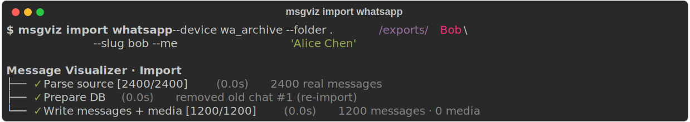

# `msgviz` — CLI reference

`msgviz` is the central command line. Every operation — init, imports,
transcription, OCR, deletion — runs through it.

Built with [Typer](https://typer.tiangolo.com/) (Rich rendering,
type-hint-driven, shell completion).

## Install

```bash
pip install msgviz                     # once published on PyPI
# or from the repo:
pip install -e .                       # editable install at repo root
```

After install, `msgviz` is in your PATH.

```bash
msgviz --help                          # overview
msgviz --install-completion            # shell completion for your shell
```

`python -m msgviz ...` is equivalent to `msgviz ...`.

---

## Command overview

| Command | Purpose |
|---|---|
| [`msgviz init`](#msgviz-init) | Create DB + config |
| [`msgviz status`](#msgviz-status) | DB stats, paths, health |
| [`msgviz check`](#msgviz-check) | Selftest — which features work on this machine |
| [`msgviz drift`](#msgviz-drift) | View / acknowledge source schema-drift events |
| [`msgviz serve`](#msgviz-serve) | Start the local web server |
| [`msgviz device`](#msgviz-device) | Manage devices |
| [`msgviz chat`](#msgviz-chat) | Manage chats |
| [`msgviz person`](#msgviz-person) | Manage persons |
| [`msgviz whatsapp`](#msgviz-whatsapp-chats) | Inspect WhatsApp Desktop (discovery) |
| [`msgviz import`](#msgviz-import) | Import data |
| [`msgviz transcribe`](#msgviz-transcribe) | Audio transcription |
| [`msgviz ocr`](#msgviz-ocr) | Image OCR |
| [`msgviz delete`](#msgviz-delete) | Delete data |

---

## `msgviz init`

Creates a fresh `data/visualizer.db` with the current schema and a
minimal `config/sources.json`.

```bash
msgviz init
msgviz init --force                    # overwrite existing DB (with confirmation)
```

DB and config live under the repo root by default. Use `MSGVIZ_HOME` to
choose a different data directory:

```bash
MSGVIZ_HOME=/var/lib/msgviz msgviz init
```

---

## `msgviz status`

DB table counts, media overview, top chats. Also useful as a health check.

```bash
msgviz status
```

Example output:

```
DB:        /Users/.../data/visualizer.db
Data dir:  /Users/.../data
Media:     /Users/.../media

     DB content
┃ table   ┃ rows   ┃
│ person  │ 13     │
│ device  │ 3      │
│ chat    │ 14     │
│ message │ 110889 │
```

---

## `msgviz check`

Selftest. Probes Python version, optional Python packages
(Pillow, pytesseract), system binaries (ffmpeg, whisper-cli,
tesseract, the macOS Vision binary), the Whisper model, and the
configured `MSGVIZ_HOME`. For each feature it reports whether it
works, what the consequence is if it doesn't, and how to fix it.

```bash
msgviz check                  # feature matrix + "How to fix" panel
msgviz check --verbose        # also show the per-probe table
msgviz check --json           # machine-readable JSON
```

Exit codes:

| Code | Meaning |
|---|---|
| 0 | Baseline OK — the server can run. Optional features may still be missing (degraded). |
| 1 | Baseline broken — Python < 3.10 or core deps (fastapi, uvicorn, typer, rich) missing. |

Run this first after a fresh install — it tells you exactly which
features will work and which won't, and what to install to enable
the rest.

---

## `msgviz drift`

Shows **schema-drift events** — recorded when an adapter notices that a
source's on-disk format changed (Apple's `chat.db`, WhatsApp's
`ChatStorage.sqlite`, an export in a locale we don't parse). Instead of
silently producing wrong data, msgviz records the change so you can see
it and decide what to do. See
[ARCHITECTURE.md](ARCHITECTURE.md#schema-drift-detection) for how it
works.

```bash
msgviz drift                      # pending (un-acknowledged) events
msgviz drift --all                # include acknowledged ones (audit trail)
msgviz drift --json               # machine-readable
msgviz drift --explain whatsapp_live   # full detail for one source
msgviz drift --ack 17             # acknowledge one event
msgviz drift --ack-all            # acknowledge everything pending
msgviz drift --ack-all --source whatsapp_live
```

Acknowledging only sets a timestamp — the row is never deleted, so the
history stays. A *fatal* event means that source can't ingest until the
contract is updated (it likely means Apple/Meta shipped a breaking
change and msgviz needs a new release).

Exit codes:

| Code | Meaning |
|---|---|
| 0 | No pending events, or a pure list/ack operation. |
| 2 | Un-acknowledged **fatal** events exist (so CI/cron can detect "a source can't ingest"). |

---

## `msgviz serve`

Starts the FastAPI live server (uvicorn).

```bash
msgviz serve                                 # 127.0.0.1:8753
msgviz serve --host 0.0.0.0 --port 9000
msgviz serve --reload                        # auto-reload (development)
```

For embedded use (your own domain, your own auth, your own reverse
proxy), see [EMBEDDING.md](EMBEDDING.md).

---

## `msgviz device`

Devices are source containers — Mac, iPhone backup, iPad backup, a
static folder with WhatsApp exports.

```bash
msgviz device add <slug> --name <name> --type <type> --owner <person>
msgviz device list
msgviz device remove <slug> [--yes]
```

**Device types** (`--type`):

| Type | Meaning |
|---|---|
| `mac_live` | Live connection to Apple's `~/Library/Messages/chat.db` (macOS only) |
| `ios_backup` | iOS backup in the MobileSync folder |
| `iphone_backup` | Like `ios_backup`, explicit path |
| `static` | Container for static imports (WhatsApp export folders etc.) |

**Example:**

```bash
msgviz device add my_mac --name "MacBook Pro" --type mac_live --owner "Alice"
msgviz device add archive --name "iPhone archive" --type static --owner "Alice"
msgviz device list
```

`remove` deletes the device **including all its chats and messages**.
It asks for confirmation unless `--yes` is set.

---

## `msgviz chat`

Chats are attached to a device.

```bash
msgviz chat add <device-slug> --slug <chat-slug> --title <title> [--origin <origin>] [--group]
msgviz chat list [--device <device-slug>]
msgviz chat remove <full-slug> [--yes]
```

**Origins** (`--origin`): `apple` (default), `whatsapp`, `signal`, `telegram`, `sms`.

**Full slug** is `<device-slug>/<chat-slug>`. Example:

```bash
msgviz chat add my_mac --slug bob --title "Bob"
# creates chat 'my_mac/bob'
msgviz chat remove my_mac/bob --yes
```

---

## `msgviz person`

Persons are source-agnostic — the same Bob on iMessage **and** WhatsApp
counts as **one** person if aliases/handles are linked correctly.

```bash
msgviz person add <name> [--aliases <comma>] [--handles <comma>]
msgviz person list
msgviz person merge <keep-id> <drop-id> [--yes]
```

**Example:**

```bash
msgviz person add "Bob Smith" \
    --aliases "Bob,Bobby,Bob S." \
    --handles "+491234567890,bob@example.com"

msgviz person list      # shows id, name, # handles, # aliases

# If two persons exist for the same human by mistake:
msgviz person merge 5 12    # keeps id=5, merges id=12 into it
```

---

## `msgviz whatsapp chats`

Lists the chats in your WhatsApp Desktop database — **discovery, no
setup**. Needs no device, no msgviz archive; it just reads the on-disk
`ChatStorage.sqlite` so you can see what's there before importing.
macOS only by default; pass `--db` elsewhere.

```bash
msgviz whatsapp chats                       # chats with ≥ 10 messages (default)
msgviz whatsapp chats -m 0                  # every chat, including tiny ones
msgviz whatsapp chats --min-messages 50     # raise the threshold
msgviz whatsapp chats --chat "Alice"        # filter by title/JID substring
msgviz whatsapp chats --json                # machine-readable
```

By default only chats with **≥ 10 messages** are shown, so the
long tail of one-off chats doesn't drown out the real conversations.
Pass `-m 0` to see everything.

Typical flow: run this first, then
[`msgviz import whatsapp-live`](#msgviz-import-whatsapp-live) with the
chats you want.

---

## `msgviz import`

### `msgviz import whatsapp`

Imports a WhatsApp export folder (containing `_chat.txt` + attachments).

```bash
msgviz import whatsapp \
    --device my_mac \
    --folder /path/to/whatsapp-export \
    --slug wa_bob \
    [--me "Alice"] \
    [--limit 100] \
    [--no-media] \
    [--no-progress]
```

* `--me`: your display name in this chat (overrides the device owner).
* `--limit`: dry-run style — only the first N messages.
* `--no-media`: skip images/audio/videos.

While the import runs, you get a live progress tree showing each phase
with a ✓ marker, item counts, durations, and the most recent status
note:



### `msgviz import imessage`

Reads Apple's `chat.db` (live or backup) and syncs only new content.

```bash
msgviz import imessage --device my_mac
msgviz import imessage --device my_mac --dry-run   # report only, nothing written
```

**Note**: `mac_live` devices only work on macOS. On Linux/Windows the
device is skipped with a notice.

### `msgviz import whatsapp-live`

Incrementally imports WhatsApp **Desktop**'s live `ChatStorage.sqlite`
(the plaintext SQLite the app keeps on disk). No network, no
companion-device pairing, no account-ban risk. Re-runs only insert
new messages (dedup via `source_ref`). **macOS only** by default;
pass `--db` with an explicit path elsewhere.

First, see what's there (no setup needed — see
[`msgviz whatsapp chats`](#msgviz-whatsapp-chats)):

```bash
msgviz whatsapp chats
```

Then import — selection is deliberate. Pick chats (repeatable substring
filter) or opt in to everything:

```bash
msgviz import whatsapp-live --device my_mac_wa --chat "Alice" --chat "Dev Team"
msgviz import whatsapp-live --device my_mac_wa --all-chats
```

With neither `--chat` nor `--all-chats`, the command errors and points
you at `msgviz whatsapp chats` — it won't silently import nothing. If
the `--device` doesn't exist yet, it offers to create it.

Before writing, it previews the chats, new-message counts, and **which
new people would be created** in your archive, then asks to confirm
(`--yes` to skip; `--dry-run` to preview and write nothing).

```bash
msgviz import whatsapp-live --device my_mac_wa --all-chats --dry-run
```

* `--db`: override the `ChatStorage.sqlite` path.
* `--no-media`: skip attachments.
* `--me`: your display name (default `Me`).

Schema drift shipped by Meta is recorded to `drift_event` (see
`msgviz drift`); a *fatal* change aborts the import with nothing
written. Anything imported is fully reversible — `msgviz delete chat
<slug>` removes the rows **and** the media files on disk.

---

## `msgviz transcribe`

Local audio transcription via [whisper.cpp](https://github.com/ggerganov/whisper.cpp).

```bash
msgviz transcribe                              # all pending audios
msgviz transcribe --chat my_mac/bob            # one chat only
msgviz transcribe --limit 10                   # first 10 only
```

**Setup prerequisites** (also printed when transcribe runs into a missing
component):

```bash
# macOS:
brew install whisper-cpp ffmpeg
mkdir -p ~/.whisper-models
curl -L -o ~/.whisper-models/ggml-large-v3.bin \
    https://huggingface.co/ggerganov/whisper.cpp/resolve/main/ggml-large-v3.bin

# Linux:
apt install ffmpeg
# build whisper.cpp from source, then:
mkdir -p ~/.local/share/whisper-models
# download the model into that directory.
```

**Environment overrides**:

| Variable | Effect |
|---|---|
| `WHISPER_CLI` | absolute path to the `whisper-cli` binary |
| `WHISPER_MODEL` | absolute path to a model file |
| `WHISPER_MODEL_DIR` | additional search directory |
| `WHISPER_MODEL_NAME` | model file name (default `ggml-large-v3.bin`) |
| `WHISPER_LANG` | `auto`, `de`, `en`, … |
| `FFMPEG` | absolute path to `ffmpeg` |

---

## `msgviz ocr`

OCR for screenshots/documents. Automatic engine selection:

* **macOS** with the built `tools/ocr/ocr` binary → Apple Vision
  (highest quality).
* **Otherwise** → Tesseract via `pytesseract`.
* **Otherwise** → null engine, no crash.

```bash
msgviz ocr                                # everything
msgviz ocr --chat my_mac/bob
msgviz ocr --limit 50
```

**Setup**:

```bash
# macOS: build the Vision binary once
swiftc -O tools/ocr/ocr.swift -o tools/ocr/ocr

# Linux: install Tesseract
apt install tesseract-ocr tesseract-ocr-deu tesseract-ocr-eng
pip install 'msgviz[ocr-tesseract]'
```

**Environment overrides**:

| Variable | Effect |
|---|---|
| `MSGVIZ_OCR_ENGINE` | `vision`, `tesseract`, `null` (override auto-detect) |
| `MSGVIZ_OCR_LANG` | Tesseract languages, e.g. `eng`, `deu+eng+ita` (default `deu+eng`) |

---

## `msgviz delete`

```bash
msgviz delete chat <full-slug> [--yes]
msgviz delete device <slug> [--yes]
msgviz delete all --confirm "yes-wipe-everything"
```

`delete all` resets the entire DB (devices, chats, persons, messages,
media references). Configuration in `config/sources.json` is preserved.
The safety string **must be exactly** `yes-wipe-everything`.

---

## Global options

| Option | Effect |
|---|---|
| `--help` | help at every level |
| `--install-completion` | install shell completion |
| `--show-completion` | print the completion script |

## Data location: `MSGVIZ_HOME`

By default, DB, media and config live under the repo root.

```bash
MSGVIZ_HOME=/var/lib/msgviz msgviz init
MSGVIZ_HOME=/var/lib/msgviz msgviz serve
```

Use `MSGVIZ_HOME` to keep separate instances (e.g. a test and a
production dataset) side by side.
